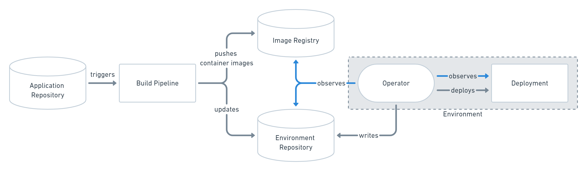
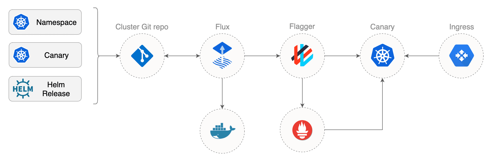
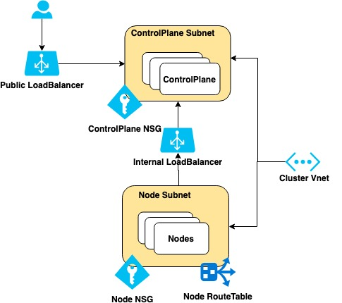

# GitOps - Cluster API, Cloud Resources, Canary Releases and Application configuration

---

# What is GitOps?

>A way of implementing Continuous Deployment for cloud native applications. It focuses on a developer-centric experience when operating infrastructure.

<!--
The core idea of GitOps is having a Git repository that always contains declarative descriptions of the infrastructure currently desired in the production environment and an automated process to make the production environment match the described state in the repository.

If you want to deploy a new application or update an existing one, you only need to update the repository
-->
---

# Okay, why should I use GitOps?

- Deploy faster more often
- Easy and fast error recovery - `git revert`
- Easier Credential Managment
- Self-documenting deployments

<!--
- __Deploy faster more often -__ Fast deployment, no switching tools `git push`

- __Easy and fast error recovery -__ Complete change history via git. Easy roll-back with `git revert`.
- __Easier Credential Managment -___ Manage deployments completely from inside your environment. Only need acces to your repository and image registry. You don't have to give your developers direct access to the environment
- __Self-documenting deployments -__
-->
---
# How does GitOps work?

__Environment Configuration as Git repository__ - There are at least two repositories: the application repository and the environment configuration repository. The application repository contains the source code of the application and the deployment manifests to deploy the application. The environment configuration repository contains all deployment manifests of the currently desired infrastructure of an deployment environment. It describes what applications and infrastructural services (message broker, service mesh, monitoring tool, …) should run with what configuration and version in the deployment environment.

---

# Push-based vs Pull-based Deployments

<!-- Two ways to implement the deployment strategy for GitOps: Push vs Pull -->

---

# Push-based deployments


---

# Pull-based deployments


---

# How does GitOps handle Dev to Prod propagation?

GitOps doesn’t provide a solution to propagating changes from one stage to the next one. We recommend using only a single environment and avoid stage propagation altogether. But if you need multiple stages (e.g., DEV, QA, PROD, etc.) with an environment for each, you need to handle the propagation outside of the GitOps scope, for example by some CI/CD pipeline.

---

# We are already doing DevOps. What's the difference to GitOps?

<!--
DevOps is all about the cultural change in an organization to make people work better together. GitOps is a technique to implement Continuous Delivery. While DevOps and GitOps share principles like automation and self-serviced infrastructure, it doesn’t really make sense to compare them. However, these shared principles certainly make it easier to adopt a GitOps workflow when you are already actively employing DevOps techniques.
-->

---

# So, is GitOps basically NoOps?

<!-- You can use GitOps to implement NoOps, but it doesn’t automatically make all operations tasks obsolete. If you are using cloud resources anyway, GitOps can be used to automate those. Typically, however, some part of the infrastructure like the network configuration or the Kubernetes cluster you use isn’t managed by yourself decentrally but rather managed centrally by some operations team. So operations never really goes away.
-->

---

# Weaveworks Flux - The GitOps Kubernetes operator

---

# The Flux Operator


---

# The Flux Helm Operator, for declarative Helming


---

# HelmRelease

```yaml
apiVersion: helm.fluxcd.io/v1
kind: HelmRelease
metadata:
  name: nginx-ingress
  namespace: ingress-nginx
  annotations:
    fluxcd.io/ignore: "false"
spec:
  releaseName: nginx-ingress
  chart:
    repository: https://kubernetes-charts.storage.googleapis.com/
    name: nginx-ingress
    version: 1.25.0
  values:
    controller:
      service:
        type: LoadBalancer
      metrics:
        enabled: true
```

---

# Example workflow

```shell
git add -A && \
git commit -m "install ingress" && \
git push origin master && \
fluxctl sync
```

---

# Automated upgrade

```yaml
apiVersion: helm.fluxcd.io/v1
kind: HelmRelease
metadata:
  annotations:
    fluxcd.io/automated: "true"
    fluxcd.io/tag.chart-image: semver:~3.0
```

---

# Flux - Progressive Delivery

For advanced deployments patterns like Canary releases, A/B testing and Blue/Green deployments, Flux can be used together with Flagger and a service mesh of your choice.


<!--
Flux can apply and manage the state of the cluster.
But how can we do rollback if a release failes?
- Flux applies resources to Kubernetes controller, if the controller accept the resource Flux will think everything is OK.
- With Helm there is some sort of testing with Helm Test. Helm also watches for deployments starting (aka health/ready points). Rooling upgrade does not take down the working application before healthz/Readys are validated.

Flagger can verify release according to business metrics. Start exposing to X% of users, Flux does not know, Flagger running the show.
-->

---

# Canary releases

```yaml
apiVersion: flagger.app/v1alpha3
kind: Canary
metadata:
  name: podinfo
  namespace: prod
  annotations:
    fluxcd.io/ignore: "false"
spec:
  targetRef:
    apiVersion: apps/v1
    kind: Deployment
    name: podinfo
  service:
    port: 9898
  canaryAnalysis:
    interval: 10s
    stepWeight: 5
    threshold: 5
    metrics:
    - name: request-success-rate
      threshold: 99
      interval: 1m
    - name: request-duration
      threshold: 500
      interval: 1m
    webhooks:
      - name: load-test
        url: http://load-tester.prod/
        metadata:
          cmd: "hey -z 2m -q 10 -c 2 http://podinfo:9898/"
```

---

# Cluster API - What is it?

> The Cluster API is a Kubernetes project to bring declarative, Kubernetes-style APIs to cluster creation, configuration, and management. It provides optional, additive functionality on top of core Kubernetes to manage the lifecycle of a Kubernetes cluster.

---

# Cluster API - Goals

- To manage the lifecycle (create, scale, upgrade, destroy) of Kubernetes-conformant clusters using a declarative API.
- To work in different environments, both on-premises and in the cloud.
- To define common operations, provide a default implementation, and provide the ability to swap out implementations for alternative ones.
- To reuse and integrate existing ecosystem components rather than duplicating their functionality (e.g. node-problem-detector, cluster autoscaler, SIG-Multi-cluster).
- To provide a transition path for Kubernetes lifecycle products to adopt Cluster API incrementally. Specifically, existing cluster lifecycle management tools should be able to adopt Cluster API in a staged manner, over the course of multiple releases, or even adopting a subset of Cluster API.


---

# Cluster API - Design



---

# Cluster API - Define a AKS cluster

```yaml
apiVersion: cluster.x-k8s.io/v1alpha3
kind: Cluster
metadata:
  name: ${CLUSTER_NAME}
spec:
  clusterNetwork:
    pods:
      cidrBlocks: ["192.168.0.0/16"]
  infrastructureRef:
    apiVersion: infrastructure.cluster.x-k8s.io/v1alpha3
    kind: AzureCluster
    name: ${CLUSTER_NAME}
---
apiVersion: infrastructure.cluster.x-k8s.io/v1alpha3
kind: AzureCluster
metadata:
  name: ${CLUSTER_NAME}
spec:
  resourceGroup: "${AZURE_RESOURCE_GROUP}"
  location: "${AZURE_LOCATION}"
  networkSpec:
    vnet:
      name: "${VNET_NAME}"
```

---
# Cluster API - Create controlle plane

```yaml
apiVersion: cluster.x-k8s.io/v1alpha3
kind: Machine
metadata:
  name: ${CLUSTER_NAME}-controlplane-0
  labels:
    cluster.x-k8s.io/control-plane: "true"
spec:
  version: ${KUBERNETES_VERSION}
  clusterName: ${CLUSTER_NAME}
  bootstrap:
    configRef:
      apiVersion: bootstrap.cluster.x-k8s.io/v1alpha3
      kind: KubeadmConfig
      name: ${CLUSTER_NAME}-controlplane-0
  infrastructureRef:
    apiVersion: infrastructure.cluster.x-k8s.io/v1alpha3
    kind: AzureMachine
    name: ${CLUSTER_NAME}-controlplane-0
---
apiVersion: infrastructure.cluster.x-k8s.io/v1alpha3
kind: AzureMachine
metadata:
  name: ${CLUSTER_NAME}-controlplane-0
spec:
  location: ${AZURE_LOCATION}
  vmSize: ${CONTROL_PLANE_MACHINE_TYPE}
  osDisk:
    osType: "Linux"
    diskSizeGB: 30
    managedDisk:
      storageAccountType: "Premium_LRS"
  sshPublicKey: ${SSH_PUBLIC_KEY}
```

---

# Cluster API - Controll plane boostrap cluster config
```yaml
apiVersion: bootstrap.cluster.x-k8s.io/v1alpha3
kind: KubeadmConfig
metadata:
  name: ${CLUSTER_NAME}-controlplane-0
spec:
  initConfiguration:
    nodeRegistration:
      name: '{{ ds.meta_data["local_hostname"] }}'
      kubeletExtraArgs:
        cloud-provider: azure
        cloud-config: /etc/kubernetes/azure.json
  clusterConfiguration:
    apiServer:
      timeoutForControlPlane: 20m
      extraArgs:
        cloud-provider: azure
        cloud-config: /etc/kubernetes/azure.json
      extraVolumes:
        - hostPath: /etc/kubernetes/azure.json
          mountPath: /etc/kubernetes/azure.json
          name: cloud-config
          readOnly: true
    controllerManager:
      extraArgs:
        cloud-provider: azure
        cloud-config: /etc/kubernetes/azure.json
        allocate-node-cidrs: "false"
      extraVolumes:
        - hostPath: /etc/kubernetes/azure.json
          mountPath: /etc/kubernetes/azure.json
          name: cloud-config
          readOnly: true
  files:
    - path: /etc/kubernetes/azure.json
      owner: "root:root"
      permissions: "0644"
      content: |
        {
          "cloud": "AzurePublicCloud",
          "tenantId": "${AZURE_TENANT_ID}",
          "subscriptionId": "${AZURE_SUBSCRIPTION_ID}",
          "aadClientId": "${AZURE_CLIENT_ID}",
          "aadClientSecret": "${AZURE_CLIENT_SECRET}",
          "resourceGroup": "${AZURE_RESOURCE_GROUP}",
          "securityGroupName": "${CLUSTER_NAME}-controlplane-nsg",
          "location": "${AZURE_LOCATION}",
          "vmType": "standard",
          "vnetName": "${CLUSTER_NAME}",
          "vnetResourceGroup": "${CLUSTER_NAME}",
          "subnetName": "${CLUSTER_NAME}-controlplane-subnet",
          "routeTableName": "${CLUSTER_NAME}-node-routetable",
          "userAssignedID": "${CLUSTER_NAME}",
          "loadBalancerSku": "standard",
          "maximumLoadBalancerRuleCount": 250,
          "useManagedIdentityExtension": false,
          "useInstanceMetadata": true
        }
```

---

# Cluster API - Create the worker nodes

```yaml
apiVersion: cluster.x-k8s.io/v1alpha3
kind: MachineDeployment
metadata:
  name: ${CLUSTER_NAME}-md-0
  labels:
    nodepool: nodepool-0
spec:
  replicas: 2
  clusterName: ${CLUSTER_NAME}
  selector:
    matchLabels:
      nodepool: nodepool-0
  template:
    metadata:
      labels:
        nodepool: nodepool-0
    spec:
      version: ${KUBERNETES_VERSION}
      clusterName: ${CLUSTER_NAME}
      bootstrap:
        configRef:
          name: ${CLUSTER_NAME}-md-0
          apiVersion: bootstrap.cluster.x-k8s.io/v1alpha3
          kind: KubeadmConfigTemplate
      infrastructureRef:
        name: ${CLUSTER_NAME}-md-0
        apiVersion: infrastructure.cluster.x-k8s.io/v1alpha3
        kind: AzureMachineTemplate
---
apiVersion: infrastructure.cluster.x-k8s.io/v1alpha3
kind: AzureMachineTemplate
metadata:
  name: ${CLUSTER_NAME}-md-0
spec:
  template:
    spec:
      location: ${AZURE_LOCATION}
      vmSize: ${NODE_MACHINE_TYPE}
      osDisk:
        osType: "Linux"
        diskSizeGB: 30
        managedDisk:
          storageAccountType: "Premium_LRS"
      sshPublicKey: ${SSH_PUBLIC_KEY}
```
---

# Cluster API - Boostrap
```yaml
apiVersion: bootstrap.cluster.x-k8s.io/v1alpha3
kind: KubeadmConfigTemplate
metadata:
  name: ${CLUSTER_NAME}-md-0
spec:
  template:
    spec:
      joinConfiguration:
        nodeRegistration:
          name: '{{ ds.meta_data["local_hostname"] }}'
          kubeletExtraArgs:
            cloud-provider: azure
            cloud-config: /etc/kubernetes/azure.json
      files:
        - path: /etc/kubernetes/azure.json
          owner: "root:root"
          permissions: "0644"
          content: |
            {
              "cloud": "AzurePublicCloud",
              "tenantId": "${AZURE_TENANT_ID}",
              "subscriptionId": "${AZURE_SUBSCRIPTION_ID}",
              "aadClientId": "${AZURE_CLIENT_ID}",
              "aadClientSecret": "${AZURE_CLIENT_SECRET}",
              "resourceGroup": "${CLUSTER_NAME}",
              "securityGroupName": "${CLUSTER_NAME}-node-nsg",
              "location": "${AZURE_LOCATION}",
              "vmType": "standard",
              "vnetName": "${CLUSTER_NAME}",
              "vnetResourceGroup": "${CLUSTER_NAME}",
              "subnetName": "${CLUSTER_NAME}-node-subnet",
              "routeTableName": "${CLUSTER_NAME}-node-routetable",
              "loadBalancerSku": "standard",
              "maximumLoadBalancerRuleCount": 250,
              "useManagedIdentityExtension": false,
              "useInstanceMetadata": true
            }
```